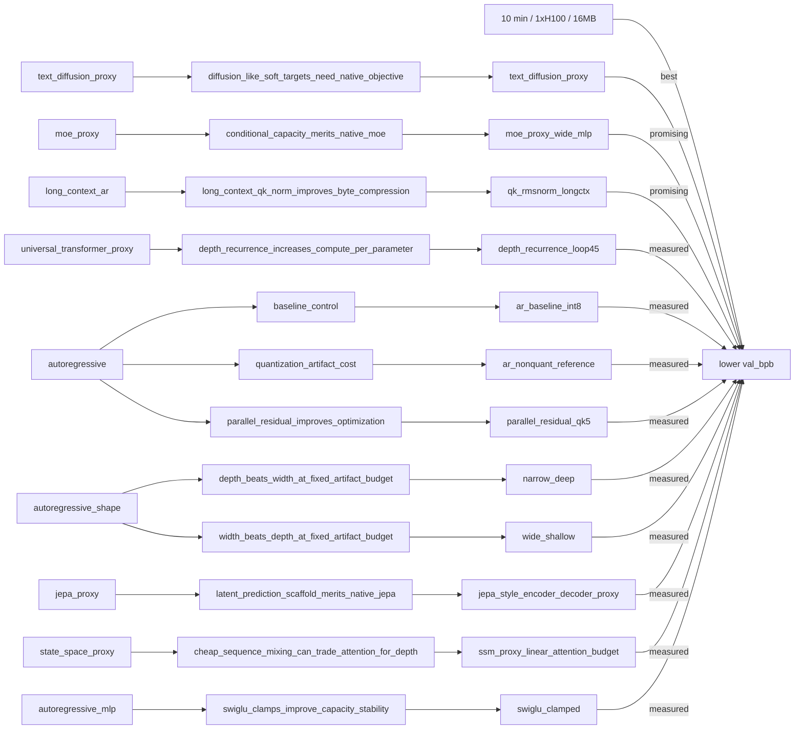

# Hypothesis Graph

```mermaid
graph LR
  constraint["10 min / 1xH100 / 16MB"] --> objective["lower val_bpb"]
  family_text_diffusion_proxy["text_diffusion_proxy"] --> hypothesis_diffusion_like_soft_targets_need_native_objective["diffusion_like_soft_targets_need_native_objective"]
  hypothesis_diffusion_like_soft_targets_need_native_objective --> candidate_text_diffusion_proxy["text_diffusion_proxy"]
  candidate_text_diffusion_proxy -- "best" --> objective
  family_moe_proxy["moe_proxy"] --> hypothesis_conditional_capacity_merits_native_moe["conditional_capacity_merits_native_moe"]
  hypothesis_conditional_capacity_merits_native_moe --> candidate_moe_proxy_wide_mlp["moe_proxy_wide_mlp"]
  candidate_moe_proxy_wide_mlp -- "promising" --> objective
  family_long_context_ar["long_context_ar"] --> hypothesis_long_context_qk_norm_improves_byte_compression["long_context_qk_norm_improves_byte_compression"]
  hypothesis_long_context_qk_norm_improves_byte_compression --> candidate_qk_rmsnorm_longctx["qk_rmsnorm_longctx"]
  candidate_qk_rmsnorm_longctx -- "promising" --> objective
  family_universal_transformer_proxy["universal_transformer_proxy"] --> hypothesis_depth_recurrence_increases_compute_per_parameter["depth_recurrence_increases_compute_per_parameter"]
  hypothesis_depth_recurrence_increases_compute_per_parameter --> candidate_depth_recurrence_loop45["depth_recurrence_loop45"]
  candidate_depth_recurrence_loop45 -- "measured" --> objective
  family_autoregressive["autoregressive"] --> hypothesis_baseline_control["baseline_control"]
  hypothesis_baseline_control --> candidate_ar_baseline_int8["ar_baseline_int8"]
  candidate_ar_baseline_int8 -- "measured" --> objective
  family_autoregressive["autoregressive"] --> hypothesis_quantization_artifact_cost["quantization_artifact_cost"]
  hypothesis_quantization_artifact_cost --> candidate_ar_nonquant_reference["ar_nonquant_reference"]
  candidate_ar_nonquant_reference -- "measured" --> objective
  family_autoregressive_shape["autoregressive_shape"] --> hypothesis_depth_beats_width_at_fixed_artifact_budget["depth_beats_width_at_fixed_artifact_budget"]
  hypothesis_depth_beats_width_at_fixed_artifact_budget --> candidate_narrow_deep["narrow_deep"]
  candidate_narrow_deep -- "measured" --> objective
  family_autoregressive_shape["autoregressive_shape"] --> hypothesis_width_beats_depth_at_fixed_artifact_budget["width_beats_depth_at_fixed_artifact_budget"]
  hypothesis_width_beats_depth_at_fixed_artifact_budget --> candidate_wide_shallow["wide_shallow"]
  candidate_wide_shallow -- "measured" --> objective
  family_jepa_proxy["jepa_proxy"] --> hypothesis_latent_prediction_scaffold_merits_native_jepa["latent_prediction_scaffold_merits_native_jepa"]
  hypothesis_latent_prediction_scaffold_merits_native_jepa --> candidate_jepa_style_encoder_decoder_proxy["jepa_style_encoder_decoder_proxy"]
  candidate_jepa_style_encoder_decoder_proxy -- "measured" --> objective
  family_state_space_proxy["state_space_proxy"] --> hypothesis_cheap_sequence_mixing_can_trade_attention_for_depth["cheap_sequence_mixing_can_trade_attention_for_depth"]
  hypothesis_cheap_sequence_mixing_can_trade_attention_for_depth --> candidate_ssm_proxy_linear_attention_budget["ssm_proxy_linear_attention_budget"]
  candidate_ssm_proxy_linear_attention_budget -- "measured" --> objective
  family_autoregressive["autoregressive"] --> hypothesis_parallel_residual_improves_optimization["parallel_residual_improves_optimization"]
  hypothesis_parallel_residual_improves_optimization --> candidate_parallel_residual_qk5["parallel_residual_qk5"]
  candidate_parallel_residual_qk5 -- "measured" --> objective
  family_autoregressive_mlp["autoregressive_mlp"] --> hypothesis_swiglu_clamps_improve_capacity_stability["swiglu_clamps_improve_capacity_stability"]
  hypothesis_swiglu_clamps_improve_capacity_stability --> candidate_swiglu_clamped["swiglu_clamped"]
  candidate_swiglu_clamped -- "measured" --> objective
```
